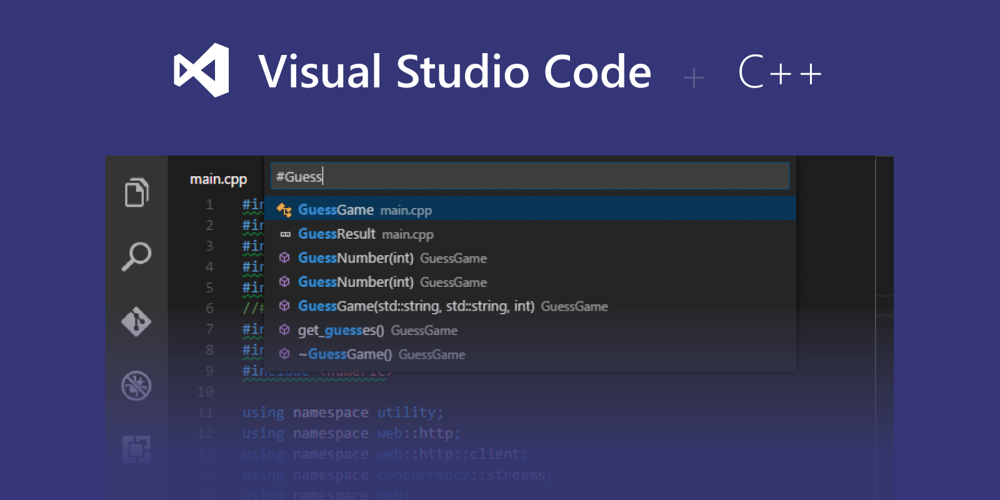

# Build and Debug C++ Application with VSCode and MSVC



Using VSCode as your main development IDE is quite interesting as it offers many features with the support of most programming languages.
To develop C/C++ applications you need to have a separate compiler installed, you can either use [MinGW](http://www.mingw.org/) or Microsoft Visual C++ compiler. In this tutorial, I'm giving you a brief tutorial about using VSCode to develop C/C++ applications with MSVC on Windows.

There is an official [tutorial](https://code.visualstudio.com/docs/cpp/config-msvc) about setting the environment but it may be unclear in some parts (e.g. it force you to use Development Command Prompt each time you open up VSCode). So I'm adding an alternative for those parts and create a custom build configuration.

## Prerequisites

1. Download and install VSCode from the official [website](https://code.visualstudio.com/download).
2. Install Microsoft Visual C++ toolset. You can use Visual Studio Installer and select `C++ build tools`. To verify the installation open up Developer Command Prompt from the Start menu and check the `cl.exe` command.
3. Install C/C++ extension for VSCode from [here](https://marketplace.visualstudio.com/items?itemName=ms-vscode.cpptools).

## Setup instructions

1. Create a directory for your project and put the required files in it. Then open the directory with VSCode. You can either use the command `code .` in terminal or right-click inside the folder and choose `open with Code`.

2. Create a simple hello world C++ file called `main.cpp` in the root of the project.

    ```cpp
    #include <iostream>
    using namespace std;

    int main()
    {
        cout << "It Works!" << endl;
        cin.get();
    }
    ```

3. Press F1 or `Ctrl+Shift+P` to open Command Palette and choose `C/C++ Edit Configurations UI`. This will open up the configuration windows. Choose the `Win32` for configuration name and set a proper compiler path. It should automatically set the path for `cl.exe` e.g `C:/Program Files (x86)/Microsoft Visual Studio/2019/Enterprise/VC/Tools/MSVC/14.21.27702/bin/Hostx64/x64/cl.exe`. You can set other options like `IntelliSense mode`, `Include path` and etc.

4. Create an empty `settings.json` file in `.vscode` directory and add the two parameters for `cl.exe` path and build directory path (if the file already exists just add these two values). In this configuration, we are creating a build directory called `build` to store the binaries. Also, we create a custom build command called `buildCommand` to execute `cl.exe` from the VS Command Prompt.

    ```json
    {
        "buildDir": "${workspaceRoot}\\build",
        "buildCommand": "C:\\Program^ Files^ ^(x86^)\\Microsoft^ Visual^ Studio\\2019\\Enterprise\\Common7\\Tools\\VsDevCmd.bat && cl"
    }
    ```

    We would be able to use these variables in other config files with `${config:<ConfigName>}` syntax.

5. Next, We are going to create a `tasks.json` file and create a task for our build. Create the `tasks.json` inside `.vscode` directory and fill it like below:

    ```json
    {
        "version": "2.0.0",
        "tasks": [
            {
                "type": "shell",
                "label": "Set dependencies for build",
                "command": "if not exist ${config:buildDir} mkdir ${config:buildDir}"
            },
            {
                "type": "shell",
                "label": "C/C++: cl.exe build active file",
                "command": "${config:buildCommand}",
                "args": [
                    "/Zi",
                    "/EHsc",
                    "/Fe:",
                    "${config:buildDir}\\${fileBasenameNoExtension}.exe",
                    "/Fo${config:buildDir}\\",
                    "/Fd${config:buildDir}\\",
                    "${file}"
                ],
                "options": {
                    "cwd": "${workspaceFolder}"
                },
                "problemMatcher": [
                    "$msCompile"
                ],
                "group": {
                    "kind": "build",
                    "isDefault": true
                },
                "dependsOn": [
                    "Set dependencies for build"
                ]
            }
        ]
    }
    ```

    The arguments for `cl.exe` are quite standard but if you want to add more options you can add them in the `args` section.

6. To verify the installation run the build task with `Ctrl+Shift+B`. This will create the `build` directory and put the output.

7. To debug your application create a `launch.json` file in `.vscode` a directory like below:

    ```json
    {
        // Use IntelliSense to learn about possible attributes.
        // Hover to view descriptions of existing attributes.
        // For more information, visit: https://go.microsoft.com/fwlink/?linkid=830387
        "version": "0.2.0",
        "configurations": [
            {
                "name": "cl.exe - Build and debug active file",
                "type": "cppvsdbg",
                "request": "launch",
                "program": "${config:buildDir}\\${fileBasenameNoExtension}.exe",
                "args": [],
                "stopAtEntry": false,
                "cwd": "${env:buildDir}",
                "environment": [],
                "externalConsole": false,
                "preLaunchTask": "C/C++: cl.exe build active file"
            }
        ]
    }
    ```

    This is a default configuration and I already change the `program` path. I also add a `preLaunchTask` to rebuild the project before launching the debug session.

8. After creating the debug configuration you can put your breakpoints and launch the debug session with F5.

## Resources

All resource files can be accessed from my GitHub [repository](https://github.com/masoudr/vscode-cpp-development.git).
